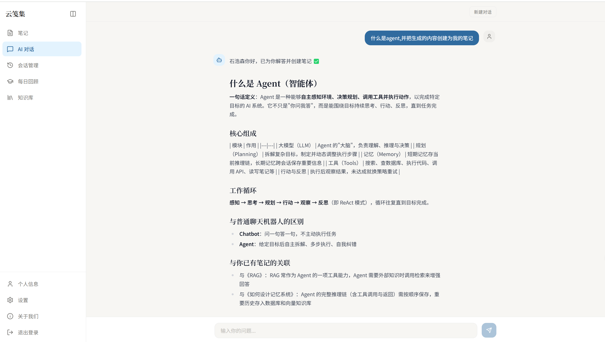
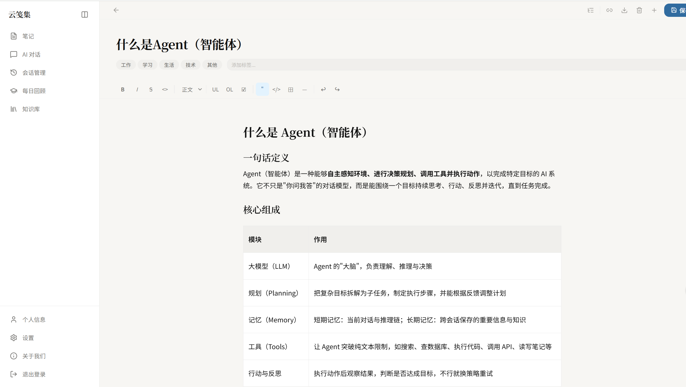
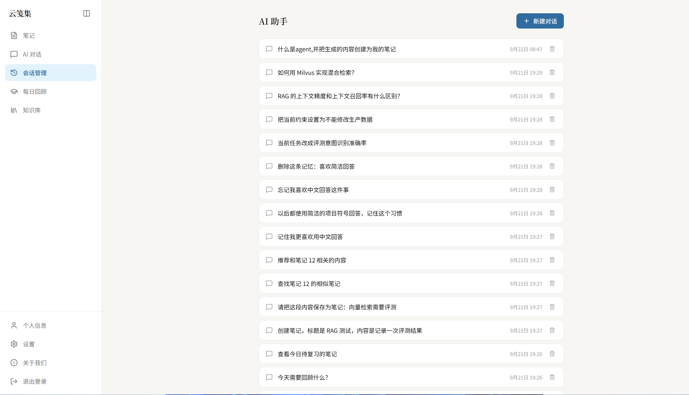
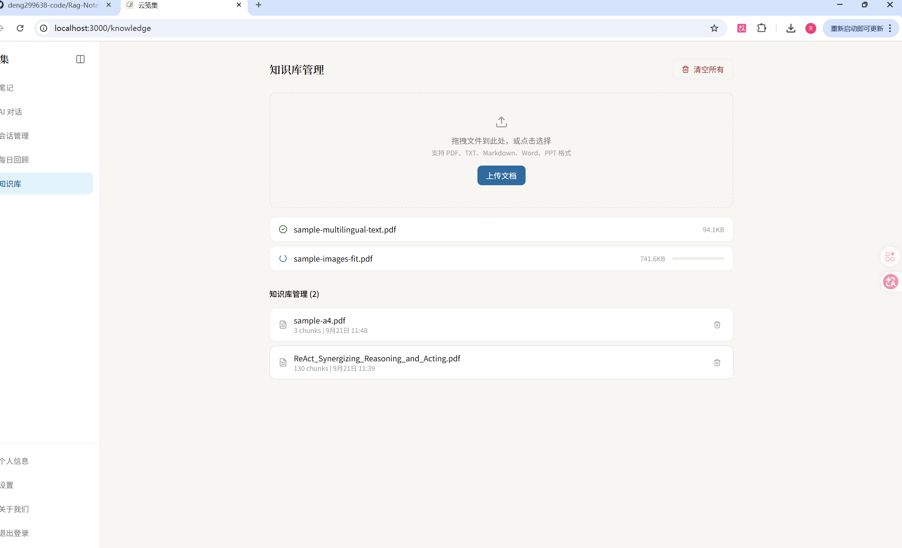
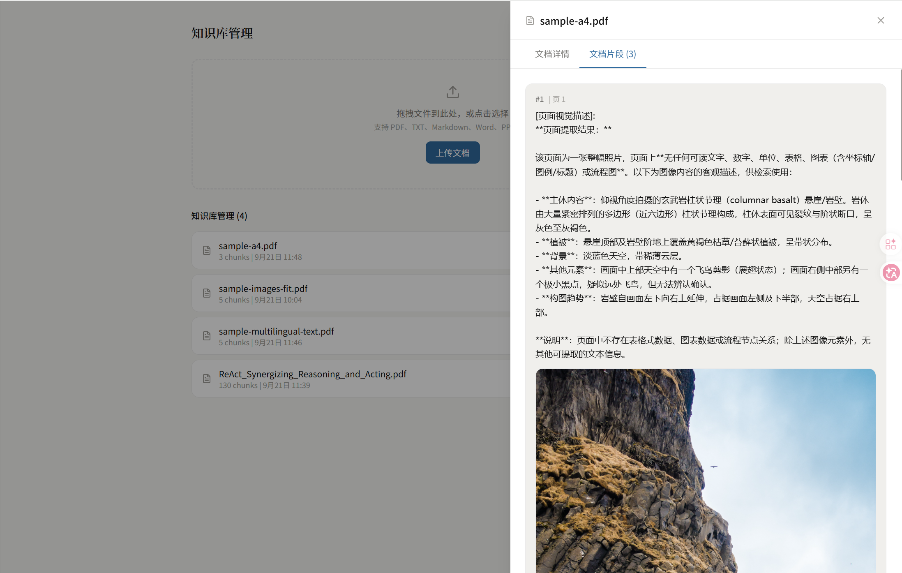
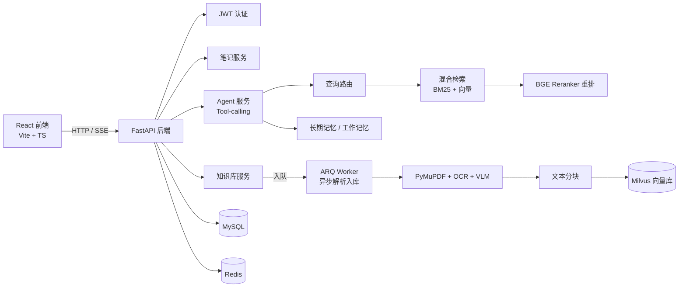

# 智能笔记助手（AI Note Assistant）

一个全栈智能笔记应用：在传统笔记管理之上，集成 **RAG 检索增强生成 Agent**、**混合检索 + 重排**、**多模态文档解析** 与 **记忆系统**，让 AI 基于你自己的笔记库和知识库回答问题。


* 后端：FastAPI（Python 3.12）

* 前端：React + TypeScript + Vite

* 向量检索：Milvus + 混合检索（BM25 + 向量）+ BGE Reranker 重排

* 文档解析：PyMuPDF + RapidOCR + VLM 多模态兜底

* 异步任务：ARQ（基于 Redis）

## 功能特性


* **智能对话 Agent**：ReAct 风格 Tool-calling Agent，SSE 流式输出，支持会话管理（列表 / 历史 / 删除）

* **笔记管理**：富文本编辑（Tiptap）、笔记模板、笔记与知识库关联

* **RAG 检索增强生成**：


  * 查询路由：判断问题是否走 RAG、是否需要改写查询

  * 混合检索：BM25 稀疏检索 + Embedding 向量检索

  * 重排：本地 BGE Reranker（bge-reranker-v2-m3）与重排置信度评估

* **知识库**：PDF 等文档上传，异步解析入库（文本提取 / OCR / VLM），自动分块并向量化

* **记忆系统**：长期记忆（向量检索 + SQL 兜底）+ 工作记忆

* **RAG 质量评测**：内置 RAGAS 评测脚本，一键评估 faithfulness /answer\_relevancy/context\_precision /context\_recall

## 功能展示











## 系统架构




## 技术栈


| 层         | 技术                                                      |
| --------- | ------------------------------------------------------- |
| 语言        | Python 3.12 / TypeScript                                |
| 后端框架      | FastAPI、Uvicorn                                         |
| ORM       | SQLAlchemy 2.x（Async） + aiomysql                        |
| 数据库       | MySQL、Redis、Milvus                                      |
| LLM       | LangChain + 阿里云百炼 OpenAI 兼容接口（qwen 系列）                  |
| Embedding | text-embedding-v3（阿里云百炼）                                |
| 重排        | BGE Reranker v2 M3（本地模型）                                |
| 文档解析      | PyMuPDF、RapidOCR（ONNX）、VLM（qwen-vl）                     |
| 异步任务      | ARQ                                                     |
| 评测        | RAGAS                                                   |
| 前端        | React、Vite、TypeScript、TailwindCSS、Tiptap、Radix UI、axios |
| 包管理       | uv（后端）、npm（前端）                                          |

## 目录结构


```
├── backend/                  # FastAPI 后端

│   ├── main.py               # 应用入口（路由注册、Redis/ARQ/建表初始化）

│   ├── core/                 # Embedding 工厂、异常处理

│   ├── db/                   # 数据库、Redis、ARQ 客户端

│   ├── models/               # SQLAlchemy 模型（笔记/用户/会话/记忆/模板）

│   ├── repository/           # 数据访问层

│   ├── services/             # 业务服务（Agent/笔记/知识库/记忆等）

│   ├── rag/                  # RAG 检索（混合检索、重排、向量存储、查询路由）

│   ├── router/               # API 路由（chat/note/knowledge/user/health）

│   ├── workers/              # ARQ 异步 Worker（知识库文档解析入库）

│   ├── utils/                # OCR、VLM、PDF 多模态解析、RAGAS 评测等

│   ├── schemas/              # Pydantic 模型

│   ├── config/               # Milvus / 分块配置

│   └── tests/                # pytest 测试

├── frontend/                 # React 前端

│   └── src/                  # 页面、组件、API 封装

├── interview\_prep/           # 面试准备材料（非核心代码）

├── pyproject.toml            # 后端依赖（uv）

└── uv.lock
```

## 快速开始

### 环境要求


* Python >= 3.12，[uv](https://docs.astral.sh/uv/) 包管理器

* Node.js >= 18

* MySQL、Redis、Milvus（本地或远程均可）

* 阿里云百炼 API Key（LLM + Embedding），可选：本地 BGE Reranker 模型

### 1. 后端


```
\# 安装依赖

uv sync

\# 配置环境变量：在 backend/ 下创建 .env，键名参考下表

\#（.env 已被 .gitignore 排除，不会提交到仓库；现有 backend/.env 可直接沿用）

\# 关键项：MySQL / Redis / Milvus 连接、OPENAI\_API\_KEY（阿里百炼）、RERANKER\_MODEL\_PATH

\# 启动后端（backend 目录下）

cd backend

uv run uvicorn main:app --reload --port 8000
```

启动时自动完成：连接 Redis、初始化 ARQ、建表（`create_tables`）、创建默认管理员（`create_admin`）。

### 2. 异步 Worker（知识库文档解析）


```
cd backend

uv run arq workers.knowledge\_worker.WorkerSettings
```

Worker 负责消费上传任务：解析 PDF（文本 / OCR / VLM）→ 分块 → Embedding → 写入 Milvus。

### 3. 前端


```
cd frontend

npm install

npm run dev
```

默认访问 `http://localhost:5173`。

## 环境变量配置

配置文件：`backend/.env`（已在 `.gitignore` 中排除，不会提交到仓库）。


| 变量                                                                                   | 说明                                                  |
| ------------------------------------------------------------------------------------ | --------------------------------------------------- |
| `MYSQL_USER` / `MYSQL_PASSWORD` / `MYSQL_HOST` / `MYSQL_PORT` / `MYSQL_DATABASE`     | MySQL 连接配置                                          |
| `REDIS_HOST` / `REDIS_PORT` / `REDIS_DB`                                             | Redis 配置（缓存 + ARQ 任务队列）                             |
| `SECRET_KEY` / `ALGORITHM`                                                           | JWT 签名配置                                            |
| `OPENAI_BASE_URL` / `OPENAI_API_KEY` / `OPENAI_MODEL_NAME`                           | LLM 接入（阿里云百炼 OpenAI 兼容接口）                           |
| `EMBED_MODEL_NAME` / `EMBED_BASE_URL` / `EMBED_API_KEY`                              | Embedding 模型（默认 text-embedding-v3；留空则复用 OPENAI\_\*） |
| `MILVUS_URI` / `MILVUS_TOKEN`                                                        | Milvus 向量库连接                                        |
| `RERANKER_MODEL_PATH`                                                                | 本地 BGE Reranker 模型路径                                |
| `VISION_ENABLED` / `VISION_BASE_URL` / `VISION_API_KEY` / `OPENAI_VISION_MODEL_NAME` | VLM 多模态解析（默认 qwen-vl-max）                           |
| `RAGAS_EVAL_MODEL`                                                                   | （可选）RAGAS 评测专用模型，推荐 qwen-turbo                      |

## API 概览


| 模块   | 方法                  | 路径                                           | 说明                  |
| ---- | ------------------- | -------------------------------------------- | ------------------- |
| 用户   | POST                | `/user/*`                                    | 注册 / 登录 / 个人信息（JWT） |
| 对话   | POST                | `/chat/agent/query/stream`                   | Agent 流式对话（SSE）     |
| 对话   | GET                 | `/chat/sessions`                             | 会话列表                |
| 对话   | GET                 | `/chat/sessions/{session_id}`                | 会话历史                |
| 对话   | GET                 | `/chat/sessions/{session_id}/messages`       | 会话消息列表              |
| 对话   | DELETE              | `/chat/sessions/{session_id}`                | 删除会话                |
| 笔记   | GET/POST/PUT/DELETE | `/note/*`                                    | 笔记 CRUD、搜索、置顶、分类、导出 |
| 模板   | GET/POST/PUT/DELETE | `/note-template/*`                           | 笔记模板管理              |
| 知识库  | POST                | `/knowledge/add/single`、`/add/multiple`      | 上传单个 / 批量文档         |
| 知识库  | GET                 | `/knowledge/list`、`/detail`                  | 文档列表 / 详情           |
| 知识库  | GET                 | `/knowledge/add/multiple/{task_id}/progress` | 批量上传任务进度            |
| 健康检查 | GET                 | `/health`                                    | Redis 等依赖健康状态       |

## RAG 质量评测（RAGAS）

内置评测脚本基于 `test_query.txt` + `test_answer.txt` 构造评测集，逐条调用 Agent 生成回答并采集检索上下文，再用 RAGAS 计算四项指标。


```
cd backend

\# 可选：指定评测专用模型（非思考模型更稳更快）

echo "RAGAS\_EVAL\_MODEL=qwen-turbo" >> .env

uv run python utils/RAGas.py
```

输出示例：


```
{'faithfulness': 0.9102, 'answer\_relevancy': 0.8748, 'context\_recall': 0.8500}
```

明细结果（每条样本的检索上下文、回答与各项得分）写入 `backend/data/ragas_results.csv`。

> 提示：评测模型若使用 qwen3 等思考模型（强制 
>
> `n=1`
>
> ），脚本会自动切换兼容模式；指定 
>
> `RAGAS_EVAL_MODEL`
>
>  为 qwen-turbo 等非思考模型可恢复原生多采样评估，指标更可靠。

## 测试


```
cd backend

uv run pytest
```

## License

MIT License
