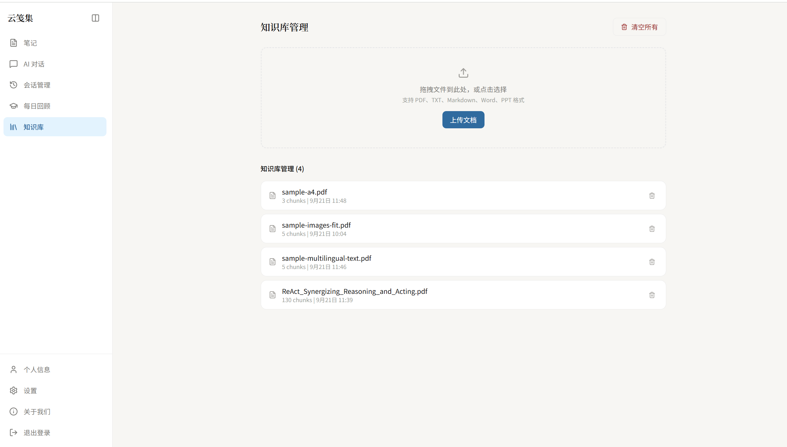

# 智能笔记助手（AI Note Assistant）

一个全栈智能笔记应用：在传统笔记管理之上，集成 **RAG 检索增强生成 Agent**、**混合检索 + 重排**、**多模态文档解析** 与 **记忆系统**，让 AI 基于你自己的笔记库和知识库回答问题。


* 后端：FastAPI（Python 3.12）

* 前端：React + TypeScript + Vite

* 向量检索：Milvus + 混合检索（BM25 + 向量）+ BGE Reranker 重排

* 文档解析：PyMuPDF + RapidOCR + VLM 多模态兜底

* 异步任务：ARQ（基于 Redis）

## 功能特性


* **智能对话 Agent**：ReAct 风格 Tool-calling Agent，SSE 流式输出，支持会话管理（列表 / 历史 / 删除）

* **笔记管理**：富文本编辑（Tiptap）、笔记模板、笔记与知识库关联

* **RAG 检索增强生成**：


  * 查询路由：判断问题是否走 RAG、是否需要改写查询

  * 混合检索：BM25 稀疏检索 + Embedding 向量检索

  * 重排：本地 BGE Reranker（bge-reranker-v2-m3）与重排置信度评估

* **知识库**：PDF 等文档上传，异步解析入库（文本提取 / OCR / VLM），自动分块并向量化

* **记忆系统**：长期记忆（向量检索 + SQL 兜底）+ 工作记忆

* **RAG 质量评测**：内置 RAGAS 评测脚本，一键评估 faithfulness /answer\_relevancy/context\_precision /context\_recall

## 功能展示





  
## 技术栈


| 层         | 技术                                                      |
| --------- | ------------------------------------------------------- |
| 语言        | Python 3.12 / TypeScript                                |
| 后端框架      | FastAPI、Uvicorn                                         |
| ORM       | SQLAlchemy 2.x（Async） + aiomysql                        |
| 数据库       | MySQL、Redis、Milvus                                      |
| LLM       | LangChain + 阿里云百炼 OpenAI 兼容接口（qwen 系列）                  |
| Embedding | text-embedding-v3（阿里云百炼）                                |
| 重排        | BGE Reranker v2 M3（本地模型）                                |
| 文档解析      | PyMuPDF、RapidOCR（ONNX）、VLM（qwen-vl）                     |
| 异步任务      | ARQ                                                     |
| 评测        | RAGAS                                                   |
| 前端        | React、Vite、TypeScript、TailwindCSS、Tiptap、Radix UI、axios |
| 包管理       | uv（后端）、npm（前端）                                          |

## 目录结构


```
├── backend/                  # FastAPI 后端

│   ├── main.py               # 应用入口（路由注册、Redis/ARQ/建表初始化）

│   ├── core/                 # Embedding 工厂、异常处理

│   ├── db/                   # 数据库、Redis、ARQ 客户端

│   ├── models/               # SQLAlchemy 模型（笔记/用户/会话/记忆/模板）

│   ├── repository/           # 数据访问层

│   ├── services/             # 业务服务（Agent/笔记/知识库/记忆等）

│   ├── rag/                  # RAG 检索（混合检索、重排、向量存储、查询路由）

│   ├── router/               # API 路由（chat/note/knowledge/user/health）

│   ├── workers/              # ARQ 异步 Worker（知识库文档解析入库）

│   ├── utils/                # OCR、VLM、PDF 多模态解析、RAGAS 评测等

│   ├── schemas/              # Pydantic 模型

│   ├── config/               # Milvus / 分块配置

│   └── tests/                # pytest 测试

├── frontend/                 # React 前端

│   └── src/                  # 页面、组件、API 封装

├── interview\_prep/           # 面试准备材料（非核心代码）

├── pyproject.toml            # 后端依赖（uv）

└── uv.lock
```

## 启动
* 前端 npm run dev
* 后端 uvicorn main:app --reload
* 异步 Worker uv run arq workers.knowledge\_worker.WorkerSettings
